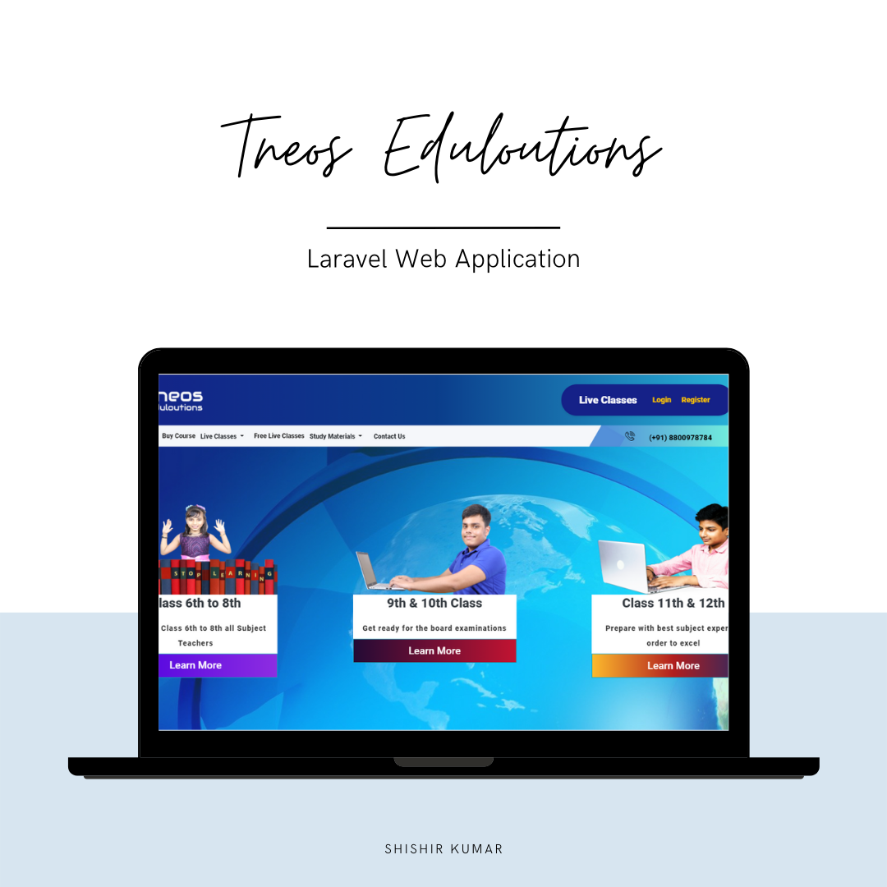

## Tneos Live Streaming Website

Tneos Live Streaming Website is developed in Laravel, Tneos is education Platform which focuses on State board, CBSE and also Competetive Examination. A mobile application is also available for Tneos Learning platform.

- [Tneos Learning app Flutter](https://github.com/CoffeeQuotes/TneosLearningFlutterApp).

Tneos Web application uses Laravel, which is accessible, powerful, and provides tools required for large, robust applications.

## Developed By

Shishir Kumar
